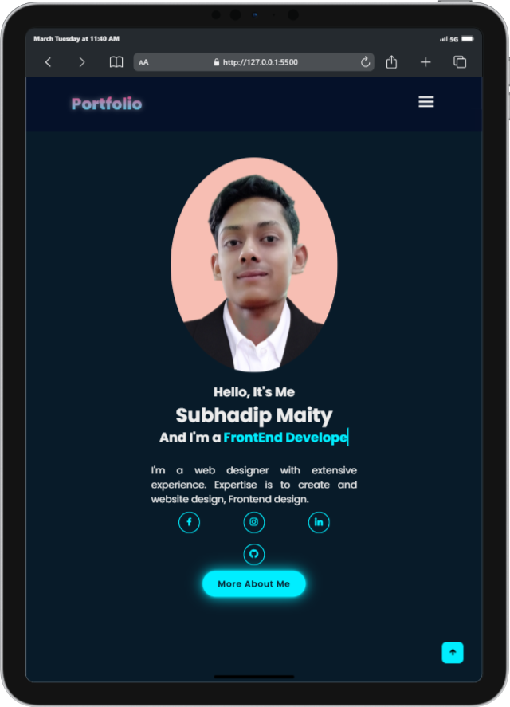

# Simple Portfolio
 By, Subhadip Maity

## Description
A simple portfolio project showcasing beautiful animations and smooth transitions. This project is ideal for beginners looking to build their first portfolio website.

## Table of Contents
- [Installation](#installation)
- [Usage](#usage)
- [Features](#features)
- [Technologies Used](#technologies-used)
- [Images](#images)
- [Notes](#notes)
- [Contact](#contact)

## Installation
1. Clone the repository:
    ```bash
    git clone https://github.com/SontuCoder/Portfolio.git
    ```

## Usage
You can customize this portfolio to represent your professional projects, skills, and personal information.

## Features
- Fully responsive design
- Smooth animations and transitions
- Loading animations
- Contact form submission

## Technologies Used
- HTML5
- CSS3
- JavaScript

## Images
- 1. Image in Mobile devices

 
- 2. Image in Mid screen size devices



## Notes
Feel free to modify the CSS to suit your design preferences.


## Contact
- Email: [subhadipmaity792@gmail.com](mailto:subhadipmaity792@gmail.com)
- GitHub: [SontuCoder](https://github.com/SontuCoder)
